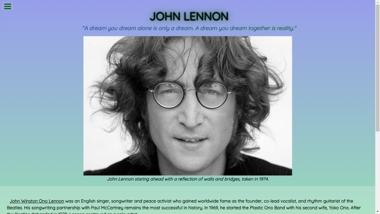
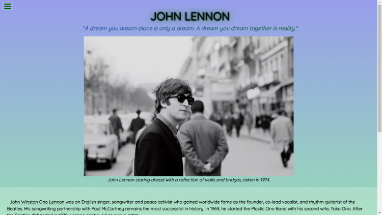
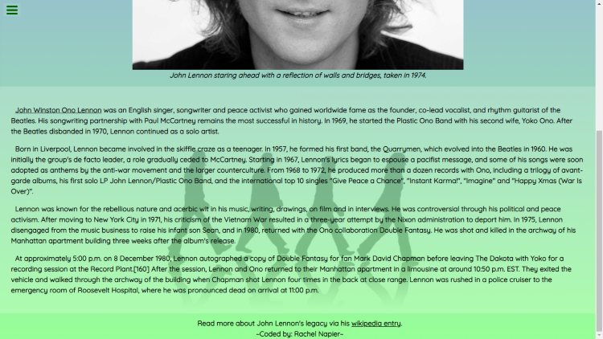

# John Lennon Tribute Page
<pre>
An FCC project, about the late Muscian John Lennon. Including a short biography, via his Wikipedia page, about his career as frontman of The Beatles, leading up to his death.
</pre>

<pre>
A simple, short biography.
When hovering over image, it will display 2nd image.
</pre>

<pre>
A visual of the rest of the webpage. All paragraphs inserted via Wikipedia. Link attached in the footer.
</pre>
